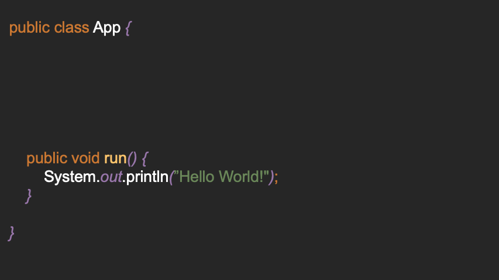

# EEEE

EEEE* is a tiny framework for simple console input of values, which I wrote mainly for exercises of
the university, because here often simple inputs with a scanner are needed, and I did not want to
rewrite them again and again.

Also, I didn't use any existing frameworks, because apparently we are only allowed to use
self-written code in the exams, and so I am allowed to use this mini-framework in the exams.

**NOTE:** This framework is ab-so-lutely not suitable for production use. 
It should only serve for practice.

## Entrypoint



The framework makes it very easy to define multiple "entry points"
(annotated with `@Entrypoint`) without always having to write different main methods:

```java
public class Application {

    @Entrypoint("Hello")
    public void sayHello() {
        System.out.println("Hello!");
    }

    @Entrypoint("World")
    public void sayWorld() {
        System.out.println("World!");
    }

}
```

If you now start the program, in via the `Starter.start` method, you will be asked which program you
want to run:

```java
public static void main(String[]args) throws Exception {
    Starter.start(Application.class, args);
}
```

Console Output:

```
1. Application::Hello@sayHello ()
2. Application::World@sayWorld ()
[?] Select Method to run [1-2]: 1
[Runner] Requesting parameters () ...

[Runner] Invoking sayHello@Application w/ ()...
---
Hello!
---
Execution complete! Took approx. 0ms.
```

### Parse Arguments

A method can have any number of arguments. If the type is a standard type
(defined in the package: `io.d2a.eeee.wrapper.wrappers`) the user is asked for an input and tries to
parse the input:

```java
@Entrypoint("Echo")
public void echo(final String input) {
    System.out.println("Echo! "+input);
}
```

Console Output:

```
[string] [] arg0 []: test
---
Echo! test
---
```

#### Customize Prompt

Since the parameter name is unknown at runtime, you'll be prompted with `arg0`, `arg0`, ...

These names can be changed with the `@Prompt` annotation:

```java
@Entrypoint("Echo")
public void echo(@Prompt("Echo!") final String input) {
    System.out.println("Echo! "+input);
}
```

Console-Output:

```
[string] [] Echo! []: hi!
---
Echo! hi!
---
```

#### Defaults

Default values can be specified using the `@Default` annotation.

```java
@Entrypoint("Echo")
public void echo(@Default("Hello :)") @Prompt("Echo!") final String input) {
    System.out.println("Echo! "+input);
}
```

Console-Output:

```
[string] [] Echo! [Hello :)]: 
---
Echo! Hello :)
---
```

#### Validation

A simple validation (e.g. minimum or maximum values for numbers, as well as the length of strings)
can be specified using the `@Min`, `@Max` annotation:

```java
@Entrypoint("Echo")
public void echo(@Prompt("Age") @Min(0) @Max(100) final int age) {
    System.out.println("You're "+age+" years old!");
}
```

Console-Output:

```
[int] [0-100] Age []: -100
[int] [0-100] Age []: 101
[int] [0-100] Age []: 19

[Runner] Invoking echo@Application w/ (i)...
---
You're 19 years old!
---
```

#### Other (more or less) useful Annotations

##### ForceRun

An EntryPoint can additionally be unannotated with `@ForceRun`, 
which causes the specified EntryPoint to be executed on startup without prompting. 
This is practical, for example, if you want to test an entrypoint individually 
and do not want to enter again and again which entrypoint you want to start.

```java
@ForceRun
@Entrypoint("Name")
public void echo() {
    System.out.println("Hello World!");
}
```

##### Trim

Trim can be used on strings to remove spaces from entered strings. By default this function is on,
but can be turned off by passing false:

```java
@Entrypoint("Name")
public void echo(@Prompt("Name") @Trim(false) String str) {
    System.out.printf("Hello, %s!%n",str);
}
```

### Custom Wrappers

If you want to use your own types as parameters, 
these types must implement the `Wrapper<T>` interface:

```java
import io.d2a.eeee.annotations.AnnotationProvider;
import io.d2a.eeee.generate.Factory;
import io.d2a.eeee.wrapper.Wrapper;
import java.util.Scanner;

public class Rectangle implements Wrapper<Rectangle> {

    /**
     * @param scanner contains a Scanner which can be used to ask for input in the console
     * @param prompt contains the value of @Prompt() or the parameter name if empty
     * @param provider can be used to request annotations of a parameter, e. g. @Max
     * @return
     */
    @Override
    public Rectangle wrap(Scanner scanner, String prompt, AnnotationProvider provider) {
        // See below for information about the Factory helper class
        return Factory.createClass(scanner, Rectangle.class);
    }

}
```

Now the rectangle can be used as a parameter in an Entry method:

```java
@Entrypoint
public void run(@Prompt("Rect") Rectangle rect) {
    System.out.println(rect);
}
```
Console-Output:
```java
[Runner] Requesting parameters (R) ...

[int] [0-] Height [12]: 
[int] [0-] Width []: 41

[Runner] Invoking echo@Application w/ (R)...
---
Rectangle{height=12, width=41}
---
Execution complete! Took approx. 4ms.
```

- See **example** for a full example.
- See **wrappers** for some predefined wrappers


---

## Generator


Sample objects can be created with the help of the `RandomFactory`. 
To do this, any constructor in the target class must be annotated with `@Generate`.

**NOTE:** make sure all parameters can be generated.

```java
// define person class
public class Person {
    private final String name;
    private final int age;

    @Generate
    public Person(final String name, final int age) {
        this.name = name;
        this.age = age;
    }
    
    // ...
}

// application
public class App {

    @Entrypoint
    public void run() {
        final Person person = RandomFactory.createRandom(Person.class);
        System.out.println(person); // Person{name='AhgrEgVB', age=9}
    }
    
}
```

### Customize generator

The number range can be adjusted with `@Min` and `@Max`. 
String lengths can also be adjusted with these annotations.

This annotation can be written via the constructor to be applied to multiple parameters.

```java
class Person {
    @Generate
    public Person(final String name, @Max(100) final int age) {
        this.name = name;
        this.age = age;
    }
    // or
    @Generate @Max(100) // applied for a and b
    public Person(final int a, final int b) {
        // ...
    }
}
```

You can implement your own generators by implementing the Generator<T> 
interface in the class to be generated.

```java
public class A implements Generator<A> {
    @Override
    public A generate(final Random random, final AnnotationProvider provider) {
        return new A(); // generate something
    }
}

public class B {
    @Generate 
    public B(final A a) {
        // ...
    }
}
```

Generators can be overridden for certain parameters using @Use:

```java
class Person {
    @Generate
    public Person(
        @Use(RandomNameGenerator.class) final String name,
        @Max(100) final int age
    ){
        this.name = name;
        this.age = age;
    }
}
// RandomFactory.createRandom(Person.class) produces:
// Person{name='Gary', age=54}
```

## Factory

Using the Factory class, you can create POJO classes that require input, for example.

The "classic" way would be:

```java
public class Rectangle {

    private int height;
    private int width;

    public Rectangle(int height, int width) {
        this.height = height;
        this.width = width;
    }
}

public class App {

    @Entrypoint("Create Rectangle")
    public void echo(
        @Prompt("Height") int height,
        @Prompt("Width") int width
    ) {
        Rectangle rect = new Rectangle(height, width);
        System.out.println(rect);
    }

}
```

With the help of the Factory class you can now simplify the creation of the class:

```java
import io.d2a.eeee.inject.Inject;

public class Rectangle {

    @Prompt("Height")
    private int height;
    @Prompt("Width")
    private int width;
}

public class App {

    @Inject
    private Scanner scanner;

    @Entrypoint("Create Rectangle")
    public void echo() {
        Rectangle rect = Factory.createClass(this.scanner, Rectangle.class);
        System.out.println(rect);
    }

}
```

**NOTE:** The Factory class currently only accesses the default constructor (without arguments). The
values are ***injected only after the object is initialized**.*

---

## Injection

The framework includes a Mini-Injector functionality.
Injected values can be used in entrypoint classes by default:

```java
import io.d2a.eeee.annotations.Entrypoint;
import io.d2a.eeee.inject.Inject;

public class App {

    @Inject
    private Scanner scanner; // scanner which asks for user input
    
    @Inject("args")
    private String[] args; // program args

    @Entrypoint
    public void hello() {
        final String line = this.scanner.nextLine();
        System.out.println(line);
    }

}
```

Default injectable values:
- Type `Scanner`, Name: None (`@Inject Scanner scanner`)
- Type: `String[]`, Name: `args` (`@Inject("args") String[] args`)

### Custom Injection

```java
import io.d2a.eeee.inject.Inject;

public class App {

    @Inject("name")
    private String name;
    
    @Inject
    private int age;

    public static void main(String[] args) {
        final Injector injector = new Injector()
            .register(String.class, "Thorsten", "name")
            .register(int.class, 22);
        
        final App app = new App();
        injector.inject(app);
        app.print();
    }
    
    public void print() {
        System.out.printf("%s is %d.%n", this.name, this.age);
    }

}
```

---


## Installation

### Maven

1. Add this repository to your `pom.xml`:

```xml
<repositories>
    <repository>
        <id>jitpack.io</id>
        <url>https://jitpack.io</url>
    </repository>
</repositories>
```

2. Add the `eeee`-dependency:

[](https://jitpack.io/#darmiel/eeee)


```xml
<dependency>
    <groupId>com.github.darmiel</groupId>
    <artifactId>eeee</artifactId>
    <version>-SNAPSHOT</version>
</dependency>
```

---

*) To be honest, I've already forgotten the meaning of the abbreviation. But it was certainly
perfect!
