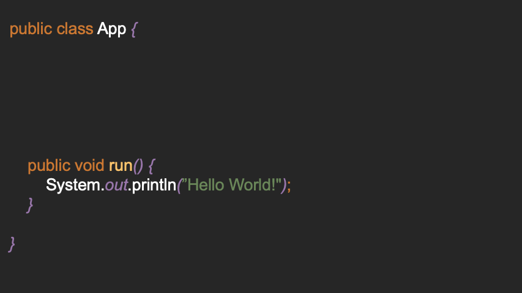

# Entrypoint



The framework makes it very easy to define multiple "entry points"
(annotated with `@Entrypoint`) without always having to write different main methods:

```java
public class Application {

    @Entrypoint("World")
    public void printWorld() {
        System.out.println("World!");
    }


    @Entrypoint("Echo")
    public void runEcho(@Prompt("What") final String what) {
        System.out.printf("Echo! %s%n", what);
    }

}
```

If you now start the program, invoking `Starter.start` in your main method, you will be asked which
program you want to run:

```java
public static void main(String[] args) throws Exception {
    Starter.start(Application.class, args);
}
```

Console Output:

```
1. Application::World@printWorld ()
2. Application::Echo@runEcho ()
[?] Select Method to run [1-2]: 1
---
Hello!
---
```

## Parse Arguments

A method can have any number of arguments. If the type is a standard type (defined in the
package: `io.d2a.eeee.wrapper.wrappers`)
the user is asked for an input and tries to parse the input:

```
[string] What > test
---
Echo! test
---
```

You can customize the prompt by setting the `@Prompt`-annotation. This is optional, but without the
annotation, you'd be prompted with `arg0`, ..., `arg{n}`.

### Defaults

Default values can be specified using the `@Default` annotation.

```java
@Entrypoint("Echo")
public void echo(
    @Default("Nice") @Prompt("Echo") 
    final String input
) {
    System.out.println("Echo! "+input);
}
```

Console-Output:

```
[string] Echo [Nice] > {Enter} 
---
Echo! Nice
---
```

### Validation

If you want to limit numbers to a certain range, or to limit a string to a certain length, you can
use the `@Range`-annotation. The `@Range`-annotation accepts 1 to 3 arguments:

`@Range({1, 10})` -> 1 to 10
`@Range({1, 10, 2})` -> 1 to 10 with steps of 2: 1, 3, 5, 7, 9
`@Range(10)` -> 0 to 10

```java
@Entrypoint
public void run(
    @Range({0, 100}) final int age
) {
    // ...
}
```

Console-Output:

```
[int] [0-100] Age: -100
[int] [0-100] Age: 101
[int] [0-100] Age: 19

---
// ...
---
```

### Transform

String inputs can be transformed during the parse process using the `@Transform` annotation. You can
choose from the following actions:

- UPPER
- LOWER
- TRIM
- REVERSE

```java
@Entrypoint
public void run(
    @Prompt("Name")
    @Transform({Types.UPPER, Types.REVERSE}) 
    final String name
){
    System.out.println(name);
}

// input "Michael" will be transformed to "LEAHCIM"
```

## Custom Wrappers

If you want to use your own types as parameters, these types must implement the `Wrapper<T>`
interface:

```java
public class Rectangle implements Wrapper<Rectangle> {

    /**
     * @param scanner contains a Scanner which can be used to ask for input in the console
     * @param prompt contains the value of @Prompt() or the parameter name if empty
     * @param provider can be used to request annotations of a parameter, e. g. @Max
     * @return
     */
    @Override
    public Rectangle wrap(Scanner scanner, String prompt, AnnotationProvider provider) {
        // See below for information about the Factory helper class
        return Factory.createClass(scanner, Rectangle.class);
    }

}
```

Now the rectangle can be used as a parameter in an Entry method:

```java
@Entrypoint
public void run(@Prompt("Rect") Rectangle rect) {
    System.out.println(rect);
}
```

Console-Output:

```
[int] [0-] Height:12
[int] [0-] Width:41

---
Rectangle{height=12,width=41}
---
```

- See [example](https://github.com/darmiel/eeee/tree/main/src/main/java/example) for a full example. 
- See [wrappers](https://github.com/darmiel/eeee/tree/main/src/main/java/io/d2a/eeee/wrapper/wrappers)
for some predefined wrappers
