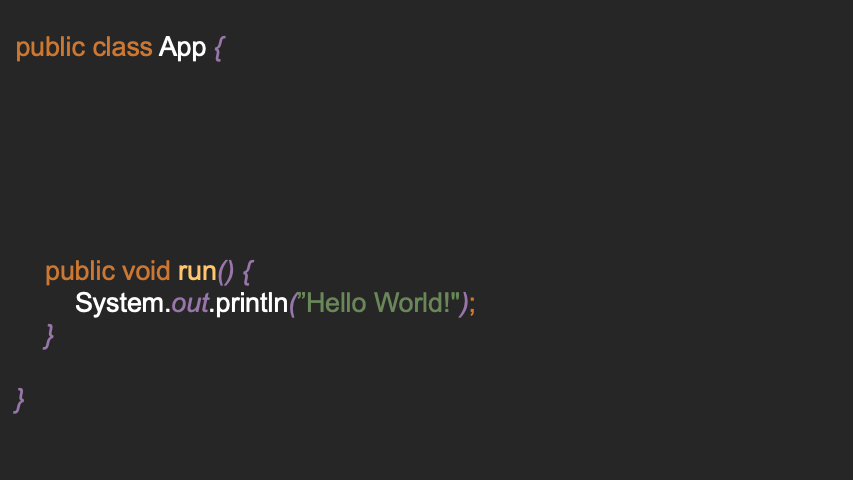

# Creating the First Entry Point

**Note:** This GIF is already outdated, but it is still a good example.



1. In your main method run `Starter#start`:
```java
public class MyMain {
    public static void main(String[] args) throws Exception {
        Starter.start(MyMain.class, args)
    }
}
```

2. Create a method with any named annotated by `@Entrypoint`:
```java
@Entrypoint
public void run() {
    System.out.println("Hello World!");
}
```

3. Run the application:
  ```
  Hello World!
  ```

4. Now let's create even more entry points:
  ```java
  @Entrypoint("Hello World")
  public void runHelloWorld() {
      System.out.println("Hello World!");
  } 

  @Entrypoint("Joke")
  public void runJoke() {
      System.out.println("Why did the programmier quit his job? Because he didn't get arrays.");
  } 
  ```

5. If the application is now run again, we will be asked at startup which entrypoint we want to start:
  ```
  1. GettingStarted::Hello World@runHelloWorld ()
  2. GettingStarted::Joke@runJoke ()
  🪄 Select Method to run [1-2/{name}]: runJoke

  Why did the programmier quit his job? Because he didn't get arrays.
  ```

**Attributes for `@Entrypoint`**
```java
@Entrypoint(value = "xyz") // value: display name of the entrypoint
@Entrypoint(loop = true) // loop: true = run the entrypoint again after it has finished
@Entrypoint(stopwatch = true) // stopwatch: true = print the time it took to run the entrypoint
@Entrypoint(verbose = true) // verbose: true = print debugging information
```